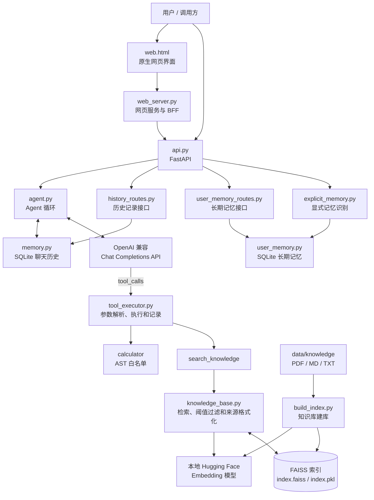
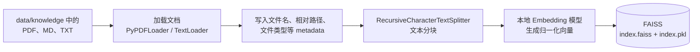
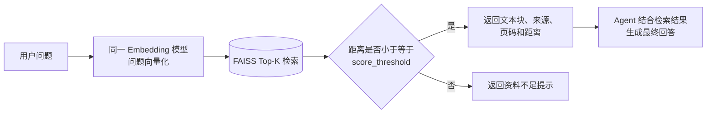
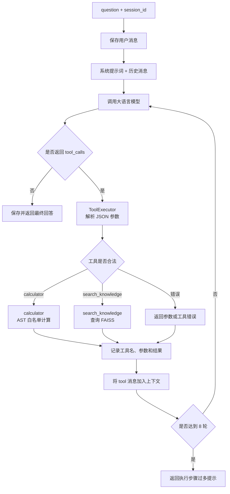

# Agentic RAG Assistant

一个面向中文场景的 Agentic RAG 助手。

项目以 OpenAI 兼容的 Chat Completions API 为推理入口，使用本地 Embedding 模型和 FAISS 管理知识库。模型能够根据用户问题自主判断是否调用工具，并在同一轮任务中组合知识库检索、计算器等能力。

项目同时提供命令行、FastAPI、原生 Web 页面、SQLite 聊天历史、显式长期记忆、RAG 检索评测、调试页面以及 Docker Compose 部署能力。

---

## 项目亮点

- **可控的 Agent 循环**：支持一轮中的多个工具调用，最多执行 8 轮模型与工具交互；模型在工具执行后生成最终答案。
- **自主工具选择**：模型根据问题自行判断是直接回答、调用知识库检索，还是执行安全计算。
- **安全工具执行**：计算器使用 AST 白名单解析，仅允许数值、正负号和 `+ - * / // % **`，不执行任意 Python 代码。
- **可追溯的本地 RAG**：支持 PDF、Markdown、TXT 及子目录；检索结果保留文件来源、PDF 页码、FAISS 距离和参考相似度。
- **分层服务化**：FastAPI 负责 Agent 对话、直接检索、知识库重建、历史记录和长期记忆接口；原生网页服务通过 HTTP 调用 API。
- **持久化聊天历史**：聊天记录通过 SQLite 按 `session_id` 保存，支持查看、搜索、恢复和删除，服务或容器重启后仍然保留。
- **显式长期记忆**：支持通过“请记住……”保存用户明确要求记录的信息，并提供查看和删除接口。
- **敏感信息保护**：API Key、密码、Token、私钥等内容不会被保存为长期记忆。
- **失败重试和降级**：模型请求遇到连接失败、超时、限流或临时服务错误时自动重试；工具成功但最终回答生成失败时，可直接返回工具结果。
- **可观测和可评测**：`/chat` 返回调用工具、工具参数、工具结果和耗时；项目提供 Agent 端到端评测、RAG 检索评测和交互式调试页面。
- **Docker Compose 部署**：API 和 Web 作为两个容器运行，知识文档、FAISS 索引、SQLite 数据和本地 Embedding 模型通过目录挂载保留。

---

## 项目架构图



---

## RAG 执行流程

### 离线建库



执行：

```bash
python build_index.py
```

建库脚本会：

1. 扫描 `data/knowledge/`；
2. 加载 PDF、Markdown 和 TXT；
3. 写入来源、页码、相对路径等元数据；
4. 对文档进行文本分块；
5. 使用本地 Embedding 模型生成向量；
6. 建立 FAISS 索引；
7. 保存到 `faiss_index/`。

知识文档发生变化后，需要重新构建索引。

> FAISS 本地索引会反序列化 `index.pkl`，因此只应加载自己生成或可信来源的索引文件。

### 在线检索



FAISS 距离越小，通常表示文本块与问题越相关。

默认配置：

```toml
top_k = 3
score_threshold = 1.0
```

实际项目中应结合真实语料和 `evaluate_retrieval.py` 的评测结果调整参数。

---

## Agent 工具调用流程



模型请求对以下异常进行重试：

- 连接失败；
- 请求超时；
- 限流；
- 临时服务错误；
- 上游服务提前断开。

当前最多尝试 3 次，重试间隔通常为 1 秒、2 秒。

每个 FastAPI `session_id` 使用独立的 Agent 和锁，避免并发请求互相修改该会话的历史记录和工具调用状态。

---

## 聊天历史

聊天记录保存在：

```text
data/chat_history.db
```

主要能力：

- 按 `session_id` 保存用户和助手消息；
- 查看历史会话；
- 恢复某个会话；
- 搜索聊天内容；
- 删除指定会话；
- 服务或 Docker 容器重启后继续保留。

主要接口：

| 方法 | 路径 | 作用 |
|---|---|---|
| GET | `/history/sessions` | 获取历史会话列表 |
| GET | `/history/search` | 搜索聊天记录 |
| GET | `/history/session/{session_id}` | 获取指定会话 |
| DELETE | `/history/session/{session_id}` | 删除指定会话 |

---

## 显式长期记忆

用户可以通过下面的表达保存一条长期记忆：

```text
请记住：我的项目使用 Docker Compose 部署。
```

当前支持：

- 识别“请记住”“帮我记住”“记住：”等明确指令；
- 将记忆保存到 SQLite；
- 查看已保存记忆；
- 删除指定记忆；
- 拒绝保存 API Key、Token、密码、私钥等敏感信息。

长期记忆保存在：

```text
data/user_memory.db
```

主要接口：

| 方法 | 路径 | 作用 |
|---|---|---|
| GET | `/memory` | 查看长期记忆 |
| DELETE | `/memory/{memory_id}` | 删除指定记忆 |

当前长期记忆已经支持保存和管理，但尚未自动检索并注入普通 Agent 回答。

---

## 项目结构

```text
.
├── api.py                         # FastAPI 应用、对话、检索与路由注册
├── schemas.py                     # FastAPI 请求和响应模型
├── api_client.py                  # Web 服务调用 FastAPI 的 HTTP 客户端
├── agent.py                       # Agent 循环、模型调用、重试和降级
├── client.py                      # OpenAI 兼容客户端
├── config.py                      # 配置读取与路径处理
├── memory.py                      # SQLite 持久化聊天历史
├── history_routes.py              # 历史会话接口
├── explicit_memory.py             # 显式长期记忆识别和拦截
├── user_memory.py                 # SQLite 长期记忆存储
├── user_memory_routes.py          # 长期记忆查看和删除接口
├── prompt.py                      # 系统提示词和工具使用约束
├── tools.py                       # 安全计算器、知识库工具和工具注册
├── tools_config.py                # OpenAI Tool Calling Schema
├── tool_executor.py               # 参数解析、工具执行和调用记录
├── build_index.py                 # 文档加载、切分、向量化和保存 FAISS
├── knowledge_base.py              # FAISS 加载、检索和来源格式化
├── main.py                        # 命令行入口
├── web_server.py                  # 原生网页服务，默认端口 8001
├── web.html                       # 原生网页界面
├── rag_debug.py                   # Gradio 检索调试页，默认端口 7861
├── evaluate_retrieval.py          # RAG 检索评测
├── evaluation/
│   ├── run_evaluation.py          # Agent 端到端评测
│   ├── test_cases.json            # Agent 测试用例
│   └── results/                   # Agent 评测输出
├── data/
│   ├── knowledge/                 # PDF、Markdown、TXT 知识文档
│   ├── evaluation/
│   │   └── rag_cases.json         # RAG 检索测试用例
│   ├── chat_history.db            # 运行时聊天历史，不提交
│   └── user_memory.db             # 运行时长期记忆，不提交
├── faiss_index/                   # 运行时 FAISS 索引
├── reports/                       # RAG 评测输出
├── Dockerfile                     # Docker 镜像定义
├── docker-compose.yml             # API 与 Web 双服务编排
├── docker-up.sh                   # 首次检查、构建和启动脚本
├── dc.sh                          # 日常 Docker Compose 快捷脚本
├── DEPLOYMENT.md                  # Docker 部署与排错说明
├── config.example.toml            # 本地配置模板
├── config.docker.example.toml     # Docker 配置模板
├── requirements.txt               # 本地开发完整依赖
└── requirements-docker.txt        # Docker 运行依赖
```

---

## 环境要求

推荐环境：

- Python 3.11 或更高版本；
- WSL2 Ubuntu；
- Docker Desktop；
- 本地 Hugging Face Embedding 模型；
- 支持 Chat Completions 和 Tool Calling 的 OpenAI 兼容接口。

项目已在本地 Python 环境及 Docker `python:3.11-slim` 镜像中运行。

---

## 本地安装与配置

### 1. 进入项目

```bash
cd "$HOME/ai/ai agent"
```

### 2. 创建 Python 环境

使用 venv：

```bash
python -m venv .venv
source .venv/bin/activate
```

也可以使用 Conda 环境。

### 3. 安装依赖

```bash
python -m pip install --upgrade pip
python -m pip install -r requirements.txt
```

### 4. 创建配置文件

```bash
cp config.example.toml config.toml
```

编辑 `config.toml`：

- 顶层 `model_provider` 必须与 `[model_providers.<名称>]` 对应；
- 填写真实 API Key；
- 填写模型名称；
- 填写 OpenAI 兼容接口的 `base_url`；
- `embedding.model_path` 指向本地 Embedding 模型；
- `embedding.index_path` 指向 FAISS 索引目录；
- 建库和检索必须使用同一个 Embedding 模型。

示例结构：

```toml
model_provider = "OpenAI"

[model_providers.OpenAI]
api_key = "your-api-key"
base_url = "https://your-provider.example/v1"
model = "your-chat-model"

[embedding]
model_path = "/absolute/path/to/bge-small-zh-v1.5"
index_path = "faiss_index"
top_k = 3
score_threshold = 1.0
```

不要提交：

```text
config.toml
config.docker.toml
```

---

## 构建知识库

将知识文件放入：

```text
data/knowledge/
```

支持：

- PDF；
- Markdown；
- TXT；
- 子目录。

执行：

```bash
python build_index.py
```

生成结果保存在：

```text
faiss_index/
```

---

## 本地启动方式

所有命令均在项目根目录执行，并要求已经完成配置和知识库构建。

### 命令行

```bash
python main.py
```

输入：

```text
e
```

或：

```text
q
```

退出。

命令行模式使用固定的 `cli` 会话，连续提问可以保留上下文。

### HTTP API

```bash
python -m uvicorn api:app \
  --host 0.0.0.0 \
  --port 8000
```

API 文档：

```text
http://127.0.0.1:8000/docs
```

健康检查：

```text
http://127.0.0.1:8000/health
```

### Web 页面

先启动 HTTP API，再打开另一个 WSL 终端运行：

```bash
cd "$HOME/ai/ai agent"

python web_server.py \
  --host 0.0.0.0 \
  --port 8001
```

访问：

```text
http://127.0.0.1:8001
```

网页支持：

- 普通聊天；
- Agent 工具调用；
- RAG 问答；
- 新建对话；
- 查看历史会话；
- 恢复历史会话；
- 删除历史会话；
- 显式长期记忆；
- 知识文档管理；
- 触发知识库重建。

### 检索调试页面

```bash
python rag_debug.py
```

访问：

```text
http://127.0.0.1:7861
```

调试页面可以查看：

- Top-K 文本块；
- 文件来源；
- PDF 页码；
- FAISS 距离；
- 距离阈值判定；
- 文本预览。

---

## FastAPI 接口

主要接口：

| 方法 | 路径 | 作用 |
|---|---|---|
| GET | `/health` | API 健康检查 |
| POST | `/chat` | Agent 对话 |
| POST | `/search` | 直接检索知识库 |
| POST | `/knowledge/rebuild` | 重建并热加载知识库 |
| GET | `/history/sessions` | 获取历史会话 |
| GET | `/history/search` | 搜索聊天记录 |
| GET | `/history/session/{session_id}` | 获取指定会话 |
| DELETE | `/history/session/{session_id}` | 删除指定会话 |
| GET | `/memory` | 查看长期记忆 |
| DELETE | `/memory/{memory_id}` | 删除长期记忆 |

完整接口模型和参数请查看：

```text
http://127.0.0.1:8000/docs
```

---

## API 调用示例

### 健康检查

```bash
curl -sS http://127.0.0.1:8000/health \
  | python -m json.tool --no-ensure-ascii
```

### Agent 对话

```bash
curl -sS \
  -X POST http://127.0.0.1:8000/chat \
  -H "Content-Type: application/json" \
  -d '{
    "session_id": "demo-001",
    "question": "计算 123*456，并查询知识库说明 RAG 的基本流程"
  }' | python -m json.tool --no-ensure-ascii
```

`POST /chat` 响应示例：

```json
{
  "answer": "123 * 456 = 56088。",
  "session_id": "demo-001",
  "called_tools": [
    "calculator"
  ],
  "tool_calls": [
    {
      "tool_name": "calculator",
      "arguments": {
        "expression": "123*456"
      },
      "result": "56088"
    }
  ],
  "elapsed_seconds": 0.42
}
```

### 直接检索知识库

```bash
curl -sS \
  -X POST http://127.0.0.1:8000/search \
  -H "Content-Type: application/json" \
  -d '{
    "query": "build_index.py 的作用是什么？",
    "top_k": 3
  }' | python -m json.tool --no-ensure-ascii
```

### 重建知识库

```bash
curl -sS \
  -X POST http://127.0.0.1:8000/knowledge/rebuild \
  | python -m json.tool --no-ensure-ascii
```

### 查看历史会话

```bash
curl -sS http://127.0.0.1:8000/history/sessions \
  | python -m json.tool --no-ensure-ascii
```

### 搜索聊天记录

```bash
curl -sS \
  "http://127.0.0.1:8000/history/search?q=FAISS" \
  | python -m json.tool --no-ensure-ascii
```

### 获取指定会话

```bash
curl -sS \
  http://127.0.0.1:8000/history/session/demo-001 \
  | python -m json.tool --no-ensure-ascii
```

### 删除指定会话

```bash
curl -sS \
  -X DELETE \
  http://127.0.0.1:8000/history/session/demo-001 \
  | python -m json.tool --no-ensure-ascii
```

### 保存显式长期记忆

```bash
curl -sS \
  -X POST http://127.0.0.1:8000/chat \
  -H "Content-Type: application/json" \
  -d '{
    "session_id": "memory-demo",
    "question": "请记住：我的项目使用 Docker Compose 部署。"
  }' | python -m json.tool --no-ensure-ascii
```

### 查看长期记忆

```bash
curl -sS http://127.0.0.1:8000/memory \
  | python -m json.tool --no-ensure-ascii
```

### 删除长期记忆

```bash
curl -sS \
  -X DELETE \
  http://127.0.0.1:8000/memory/1 \
  | python -m json.tool --no-ensure-ascii
```

---

## Docker Compose 部署

Docker Compose 启动两个服务：

```text
api
└── FastAPI
    └── 宿主机端口 8000

web
└── Web Server
    └── 宿主机端口 8001
```

容器之间通过 Compose 网络访问：

```text
web → http://api:8000
```

容器挂载关系：

```text
宿主机 ./data
    → 容器 /app/data

宿主机 ./faiss_index
    → 容器 /app/faiss_index

宿主机 Embedding 模型
    → 容器 /models/bge-small-zh-v1.5
```

### Docker 配置

项目提供：

```text
config.docker.example.toml
```

真实 Docker 配置为：

```text
config.docker.toml
```

Docker 配置中的关键路径：

```toml
[embedding]
model_path = "/models/bge-small-zh-v1.5"
data_path = "/app/data/knowledge"
index_path = "/app/faiss_index"

[api_client]
base_url = "http://api:8000"
```

注意：

- 模型提供商的 `base_url` 仍然是实际大语言模型接口；
- 只有 Web 调用 FastAPI 的地址使用 `http://api:8000`；
- `config.docker.toml` 包含真实 API Key，不能提交。

### 首次构建和启动

```bash
cd "$HOME/ai/ai agent"

./docker-up.sh
```

脚本会自动：

1. 检查必需文件；
2. 读取本地 Embedding 模型路径；
3. 设置 `EMBEDDING_MODEL_PATH`；
4. 创建数据目录；
5. 检查 Compose 配置；
6. 构建 API 和 Web 镜像；
7. 启动两个容器；
8. 显示容器状态。

首次构建需要安装 PyTorch、Sentence Transformers、SciPy、scikit-learn、LangChain 和 FAISS 等依赖，网络较慢时可能耗时较长。

### 日常启动

```bash
cd "$HOME/ai/ai agent"

./dc.sh up -d
```

### 查看状态

```bash
./dc.sh ps
```

正常状态类似：

```text
agentic-rag-api   Up ... healthy
agentic-rag-web   Up ...
```

### 查看日志

同时查看 API 和 Web：

```bash
./dc.sh logs -f api web
```

退出日志查看：

```text
Ctrl + C
```

这只会退出日志界面，不会停止容器。

查看 API 最近 100 行：

```bash
./dc.sh logs --tail=100 api
```

查看 Web 最近 100 行：

```bash
./dc.sh logs --tail=100 web
```

### 停止项目

日常停止：

```bash
./dc.sh stop
```

停止并删除容器和 Compose 网络：

```bash
./dc.sh down
```

这些命令不会删除：

- Docker 镜像；
- `data/` 中的聊天历史；
- `data/` 中的长期记忆；
- `data/knowledge/` 中的知识文档；
- `faiss_index/`；
- 本地 Embedding 模型。

### 重启容器

```bash
./dc.sh restart
```

该命令只重启已有容器，不会重新构建镜像。

### 修改代码后

修改以下文件后，需要重新构建：

```text
api.py
agent.py
web_server.py
web.html
knowledge_base.py
memory.py
user_memory.py
```

执行：

```bash
./dc.sh up --build -d
```

### 修改依赖后

修改以下文件后：

```text
requirements-docker.txt
Dockerfile
```

执行：

```bash
./dc.sh build --no-cache api web
./dc.sh up -d
```

Docker 使用：

```text
requirements-docker.txt
```

该文件不安装 Gradio，避免 Gradio 和 FastAPI 对 Starlette 的依赖版本发生冲突。

`rag_debug.py` 继续在本地开发环境运行。

### 访问地址

```text
Web 页面：http://127.0.0.1:8001
API 文档：http://127.0.0.1:8000/docs
健康检查：http://127.0.0.1:8000/health
```

完整部署和排错说明见：

```text
DEPLOYMENT.md
```

---

## 数据持久化

以下数据位于宿主机目录中，不存放在容器临时文件系统内：

```text
data/
faiss_index/
```

因此即使执行：

```bash
./dc.sh down
```

数据仍然保留。

主要持久化数据：

```text
data/chat_history.db
data/user_memory.db
data/knowledge/
faiss_index/
```

SQLite 在运行期间可能同时产生：

```text
*.db-shm
*.db-wal
```

这些运行时文件同样不应提交到 Git。

---

## 评测与结果

### Agent 端到端评测

```bash
python evaluation/run_evaluation.py
```

评测读取：

```text
evaluation/test_cases.json
```

主要检查：

- 是否调用预期工具；
- 最终回答是否包含预期关键词；
- 知识库检索结果是否包含预期信息；
- 是否出现系统错误；
- 是否需要人工复核。

结果写入：

```text
evaluation/results/
```

此前的验证报告包含 4 个案例，覆盖：

- 普通聊天；
- 安全计算器；
- 知识库检索；
- 多工具组合。

评测结果只代表当时的测试用例、知识库、模型接口和配置，不应视为通用准确率。

### RAG 检索评测

```bash
python evaluate_retrieval.py
```

评测集：

```text
data/evaluation/rag_cases.json
```

主要指标：

- 是否应该检索；
- 来源是否命中；
- 关键词覆盖率；
- 距离阈值判断；
- 首次命中排名；
- Reciprocal Rank；
- MRR。

评测结果写入：

```text
reports/
```

常见输出：

```text
rag_eval_summary.csv
rag_eval_details.csv
rag_eval_v2_summary.csv
rag_eval_v2_details.csv
```

不同 Embedding 模型、文本分块参数、Top-K、阈值和知识库内容都会影响评测结果。

---

## 常见问题

### Docker 命令提示缺少 `EMBEDDING_MODEL_PATH`

错误：

```text
required variable EMBEDDING_MODEL_PATH is missing a value
```

原因是直接运行了：

```bash
docker compose ...
```

日常应统一使用：

```bash
./dc.sh ...
```

例如：

```bash
./dc.sh ps
./dc.sh logs --tail=100 api
./dc.sh up -d
```

`dc.sh` 会自动从 `config.toml` 读取宿主机模型路径并设置环境变量。

### Docker Hub 下载超时

可能出现：

```text
failed to fetch oauth token
i/o timeout
```

可以先重试：

```bash
docker pull python:3.11-slim
```

仍然失败时，检查 Docker Desktop：

```text
Settings
→ Resources
→ Proxies
```

### 上游模型接口返回 502

日志可能包含：

```text
openai.APIConnectionError
httpx.RemoteProtocolError
Server disconnected without sending a response
```

这通常是上游大语言模型服务临时断开。

处理方式：

1. 重新发送问题；
2. 查看 API 日志；
3. 确认 API Key、模型名和模型接口地址；
4. 等待上游服务恢复。

查看日志：

```bash
./dc.sh logs --tail=150 api
```

### Web 返回 500

Web 服务负责转发请求，因此还需要查看 API 日志：

```bash
./dc.sh logs --tail=150 web
./dc.sh logs --tail=150 api
```

### 端口被占用

检查：

```bash
ss -ltnp | grep -E ':8000|:8001'
```

停止占用端口的本地服务：

```bash
fuser -k 8000/tcp 2>/dev/null || true
fuser -k 8001/tcp 2>/dev/null || true
```

重新启动：

```bash
./dc.sh up -d
```

---

## 安全说明

不要将以下文件提交到公开仓库：

```text
config.toml
config.docker.toml
data/chat_history.db
data/chat_history.db-shm
data/chat_history.db-wal
data/user_memory.db
data/user_memory.db-shm
data/user_memory.db-wal
```

配置模板中只保留占位符：

```toml
api_key = "your-api-key"
model = "your-chat-model"
```

部署到公网前还需要增加：

- HTTPS；
- API 身份认证；
- 请求频率限制；
- 更严格的 CORS；
- 反向代理；
- 日志脱敏；
- 密钥管理；
- 容器资源限制；
- 数据备份和恢复；
- 服务监控和告警。

当前 Docker Compose 方案主要面向本地学习、演示和作品展示。

---

## 已知限制

- 上游 OpenAI 兼容模型服务可能偶尔断开、超时或限流；Agent 已提供请求重试和工具结果降级，但无法完全消除第三方服务波动。
- 本地 Embedding 模型和 FAISS 索引需要提前准备，知识文档变化后应重新构建索引。
- 当前没有使用 Reranker，检索质量主要由 Embedding 模型、文本分块、Top-K 和距离阈值决定。
- 当前没有启用自动对话摘要，超长会话仍需要进一步增加历史裁剪和上下文长度控制。
- 显式长期记忆已经支持保存、查看和删除，但尚未自动检索并注入普通 Agent 回答。
- 第一次 Docker 构建需要安装 PyTorch、Sentence Transformers、SciPy 等较大依赖，网络较慢时耗时较长。
- 当前部署没有公网身份认证、HTTPS 和限流，不适合直接暴露在公网。
- FAISS 索引依赖本地文件，暂未实现多实例之间的自动同步。

---

## 后续计划

- 将长期记忆按相关性检索并注入 Agent 上下文；
- 增加历史消息长度控制；
- 增加自动化单元测试和接口测试；
- 增加 GitHub Actions；
- 增加 API 鉴权和访问限流；
- 增加生产环境反向代理方案；
- 增加日志结构化和敏感信息脱敏；
- 完善 RAG 评测报告；
- 优化 Web 错误提示和加载状态；
- 增加知识库增量更新能力；
- 增加公网部署方案。

---

## 项目用途

该项目主要用于学习和展示：

- LLM API 调用；
- Chat Completions；
- Function Calling；
- Agent 工具调度；
- RAG 检索流程；
- 本地 Embedding 模型；
- FAISS 向量数据库；
- 文档加载和文本分块；
- FastAPI 接口开发；
- SQLite 数据持久化；
- Web 前后端分层；
- Docker Compose 部署；
- AI 应用的调试、评测与工程化。
