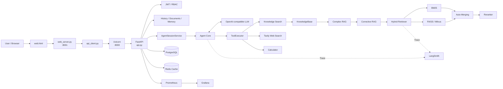

# Agentic RAG Assistant

> A production-oriented Agentic RAG application for Chinese knowledge-base question answering.

Agentic RAG Assistant 是一个面向中文知识问答场景的 **LLM Agent + Advanced RAG 工程项目**。

项目不仅完成“检索知识库 → 调用大模型 → 返回答案”，还把 **Agent 工具调用、混合检索（Hybrid Retrieval）、纠错型 RAG（Corrective RAG）、复杂问题拆解（Complex Query Decomposition）、多用户隔离、长期记忆、流式事件、评测、监控与 Docker 部署** 组合成一套可运行的应用系统。

---

## 1. 当前能力

| 模块 | 当前实现 |
|---|---|
| Agent | 多轮 Tool Calling Loop，最多 5 个模型步骤 / 5 次工具执行 |
| Tools | Knowledge Search / Tavily Web Search / Calculator / Filesystem MCP / GitHub MCP |
| MCP | MCP Server + MCP Client + Streamable HTTP |
| RAG | Hybrid RAG + Corrective RAG + Complex RAG |
| Retrieval | BM25 + Vector Search + RRF |
| Vector Backend | FAISS 默认后端；Milvus 完整闭环、租户隔离与私有实例支持 |
| Reranking | ModelScope Cross-Encoder，可配置开关 |
| Chunking | Hierarchical Chunking |
| Context | Auto-Merging |
| Memory | Chat Memory + Explicit Long-term Memory |
| Persistence | PostgreSQL；保留 SQLite 兼容路径 |
| Cache | Redis Chat History Cache，PostgreSQL 为 Source of Truth |
| Authentication | JWT + User/Admin RBAC + Multi-user Isolation；邮箱验证码登录 |
| Documents | 公共 / 私有知识文档上传、删除、重建索引；PDF/Markdown/TXT/XLSX/EML/CASE |
| API | FastAPI + Uvicorn |
| Streaming | `/chat/stream`：过程事件；`/chat/token-stream`：上游 token-level NDJSON |
| Evaluation | Retrieval Accuracy / Compare / Latency / NDCG@3；Agent Harness |
| Testing | Agent Mock Test |
| Metrics | Prometheus |
| Dashboard | Grafana |
| Tracing | LangSmith |
| Deployment | Docker Compose + MCP Sidecars |

> `/chat/token-stream` 针对无需工具规划的直接回答使用上游 token-level streaming；需要工具调用的复杂 Agent 流程仍使用现有事件流。

---

## 2. System Architecture




---

<!-- MCP_ARCH_V1_START -->

### MCP 扩展链路

Agent 除了本地 Tool Calling，还通过 MCP Client 调用外部 MCP Server：

```text
Agent
  ↓
ToolExecutor
  ↓
┌─────────────────────────────────┐
│ Local Tools                     │
│ ├── search_knowledge            │
│ ├── search_web                  │
│ └── calculator                  │
└─────────────────────────────────┘

┌─────────────────────────────────┐
│ MCP Tools                       │
│ ├── mcp_filesystem             │
│ │    ↓                         │
│ │  Streamable HTTP             │
│ │    ↓                         │
│ │  filesystem-mcp:8083/mcp     │
│ │    ↓                         │
│ │  Project Files               │
│ │                              │
│ └── github_hot_repositories    │
│      ↓                         │
│    Streamable HTTP             │
│      ↓                         │
│    github-mcp:8082             │
│      ↓                         │
│    GitHub                      │
└─────────────────────────────────┘
```

Filesystem MCP 与 GitHub MCP 作为独立 Docker Sidecar 运行。

API 容器只负责 MCP Client，不再依赖 Node.js、`npx` 或 Docker CLI。

<!-- MCP_ARCH_V1_END -->

## 3. 一次聊天请求怎么跑完

```text
Browser
  ↓
web.html
  ↓
web_server.py :8001
  ↓
api_client.py
  ↓ HTTP
Uvicorn :8000
  ↓
FastAPI / api.py
  ↓
Pydantic Request Validation
  ↓
JWT Authentication
  ↓
校验 session 属于当前用户
  ↓
AgentSessionService
  ├─ Session Lock：同一会话串行
  └─ Global Semaphore：限制总并发 Agent 数
  ↓
Agent.bind_user(user_id)
  ↓
Agent.run(session_id, question)
  ↓
Memory + LLM + Tool Calling
  ↓
Knowledge / Web / Calculator
  ↓
Final Answer
  ↓
保存聊天历史
  ↓
Response
```

流式接口：

```text
POST /chat/stream
  ↓
复用正式 /chat 执行逻辑
  ↓
实时发送 Agent / RAG 过程事件
  ↓
answer_delta 分片
  ↓
done metadata
```

传输格式：`application/x-ndjson`。

---

## 4. Agent Architecture

核心目录：

```text
app/agent/
├── agent.py
├── prompt.py
├── tool_executor.py
├── tools.py
└── tools_config.py
```

Agent 主循环：

```text
User Query
   ↓
Load Chat History
   ↓
Load Explicit Long-term Memory
   ↓
Call LLM
   ↓
tool_calls ?
   │
   ├─ No → Final Answer
   │
   └─ Yes
        ↓
     ToolExecutor
        ↓
     Tool Result
        ↓
     Append Tool Message
        ↓
     Call LLM Again
```

### Loop Protection

当前代码包含：

- 最大模型步骤：5
- 最大工具执行次数：5
- 完全相同 Tool Call 去重
- 模型调用失败重试
- 工具结果降级返回
- Session Lock
- Global Agent Semaphore

Agent Mock 测试：

```bash
python tests/test_agent_mock.py
```

覆盖：

- No Tool
- Single Tool
- Multi-step Tool Calling
- Duplicate Tool Protection
- Max Tool-call Protection

---

## 5. Agent Tools


### `search_knowledge`

调用本地知识库与 Advanced RAG。

```text
Agent
  ↓
ToolExecutor
  ↓
search_knowledge
  ↓
KnowledgeBase
  ↓
Advanced RAG
```

### `search_web`

通过 Tavily Search API 获取实时公开信息。API Key 优先读取环境变量：

```text
TAVILY_API_KEY
```

### `calculator`

执行受控数学表达式计算。

---

<!-- MCP_TOOLS_V1_START -->

### `mcp_filesystem`

通过 Filesystem MCP 访问当前项目文件。

支持：

```text
list
read
search
```

调用链：

```text
Agent
  ↓
ToolExecutor
  ↓
mcp_filesystem
  ↓
app/integrations/mcp_external.py
  ↓
MCP Client
  ↓
Streamable HTTP
  ↓
filesystem-mcp:8083/mcp
  ↓
Project Files
```

安全边界：

- 项目目录以只读 Volume 挂载；
- MCP Server 只允许访问项目根目录；
- Client 只接受项目内相对路径；
- 禁止绝对路径与 `..` 路径逃逸。

### `github_hot_repositories`

通过 GitHub 官方 MCP Server 搜索仓库。

调用链：

```text
Agent
  ↓
ToolExecutor
  ↓
github_hot_repositories
  ↓
app/integrations/mcp_external.py
  ↓
MCP Client
  ↓
Streamable HTTP
  ↓
github-mcp:8082
  ↓
GitHub
```

当前 GitHub MCP 使用仓库相关 Toolset，并以只读方式运行。

当前 `github_hot_repositories` 的“热门”定义为：

```text
最近 N 天创建
+ Star 数达到指定阈值
+ 按当前 Star 数排序
```

它不是严格意义上的“N 天内 Star 增长排行榜”。

### MCP Server

项目自身还提供 MCP Server：

```text
app/integrations/mcp_server.py
```

用于把项目自身能力以标准 MCP Tool 的形式暴露给外部 MCP Client。

因此项目同时实现：

```text
MCP Server
+
MCP Client
+
Tool Discovery / Tool Call
+
Streamable HTTP
+
Docker MCP Sidecar
```

<!-- MCP_TOOLS_V1_END -->

## 6. Advanced RAG

核心目录：

```text
rag/
├── auto_merger.py
├── corrective_rag.py
├── hierarchical_chunks.py
├── knowledge_base.py
├── milvus_store.py
├── rag_graph.py
├── reranker.py
├── retriever.py
└── vector_backends.py
```

整体流程：

```text
Question
   ↓
Complexity Routing
   ↓
┌───────────────────────────────┐
│                               │
Simple Query                Complex Query
│                               │
Corrective RAG              Query Decomposition
│                               │
Hybrid Retrieval            LangGraph Send
│                               │
Evidence Grade              Parallel Retrieval
│                               │
Query Rewrite               Evidence Merge
│                               │
Retry Retrieval             Coverage Grade
│                               │
└──────────────┬────────────────┘
               ↓
          Final Evidence
               ↓
             Agent
```

---

## 7. 混合检索（Hybrid Retrieval）

核心：`rag/retriever.py`

```text
Query
  ├─ BM25 Keyword Retrieval
  └─ Vector Retrieval (FAISS / Milvus)
          ↓
         RRF
          ↓
   Candidate Documents
          ↓
     Auto-Merging
          ↓
   Reranker (Optional)
          ↓
        Top-K
```

- **BM25**：补强关键词、专有名词、文件名等精确匹配。
- **Vector Retrieval**：负责语义相似召回。
- **RRF**：基于排名融合两路候选结果。
- **Reranker**：使用 Cross-Encoder 对候选结果再次排序，可通过配置关闭。

---

## 8. 纠错型 RAG（Corrective RAG）

核心：`rag/corrective_rag.py`

```text
Query
  ↓
Retrieval #1
  ↓
Evidence Grade
  ↓
Sufficient?
  ├─ Yes → Return Evidence
  └─ No
       ↓
   Query Rewrite
       ↓
   Retrieval #2
       ↓
   Evidence Grade
       ↓
   Return Evidence / Explicit Insufficient Result
```

当 Grade 模型不可用时，代码会降级保留已有检索证据，避免整个 RAG 链路直接失败。

---

## 9. 复杂问题拆解（Complex Query Decomposition）

核心：`rag/rag_graph.py`

明显简单的问题走 Fast Path；复杂问题由规划器拆成 2～4 个子问题，再使用 LangGraph `Send` 并行检索。

```text
Original Question
  ↓
Simple Fast Path?
  ├─ Yes → Normal Corrective RAG
  └─ No
       ↓
    Complexity Planner
       ↓
    2～4 Subquestions
       ↓
    LangGraph Send
       ↓
    Parallel Retrieval
       ↓
    Evidence Merge
       ↓
    Coverage Grade
       ↓
    Final Context
```

---

## 10. Hierarchical Chunking + Auto-Merging

核心：

```text
rag/hierarchical_chunks.py
rag/auto_merger.py
```

建库：

```text
Document
  ↓
Parent Chunk
  ↓
Child Chunks
  ↓
Embedding
  ↓
Vector Store
```

检索阶段先匹配 Child Chunk；当同一 Parent 下命中足够多 Child 时，再合并返回更完整的 Parent Context。

---

## 11. Vector Backends

统一适配层：`rag/vector_backends.py`

### FAISS

当前默认正式向量后端。

```text
faiss_index/
├── index.faiss
├── index.pkl
└── parent_store.json
```

### Milvus

项目已经包含：

```text
Milvus Standalone
├── etcd
└── MinIO
```

Milvus 与 FAISS 共用同一套 Child/Parent 索引生命周期：FAISS 作为本地构建事实源，完整同步或增量更新时同步到 Milvus；公共知识库使用基础 collection，用户私有知识库使用 `agentic_rag_chunks_user_<user_id>` 独立 collection。Milvus collection 缺失或 Schema 不兼容时，服务会明确报错并按配置回退 FAISS，不会静默返回空结果。

完整同步公共索引：

```bash
docker compose exec -T api python scripts/build_milvus_shadow.py
```

公共 Milvus、私有 Milvus 和检索隔离验收：

```bash
docker compose exec -T api \
python scripts/milvus_live_smoke.py \
  --private-user-id 8 \
  --other-private-user-id 9
```

`milvus_live_smoke.py` 是只读检查：验证 collection 存在、Schema 完整、Child/Parent 数量、真实向量检索结果，以及公共/不同用户 collection 的硬隔离。私有用户没有建库时，先通过文档上传接口触发该用户的索引构建和 Milvus 同步。

---

## 12. Knowledge Base Build

入口：

```bash
python build_index.py
```

流程：

```text
data/knowledge/
  ↓
Load PDF / Markdown / TXT
  ↓
Metadata
  ↓
Hierarchical / Normal Chunking
  ↓
Embedding
  ↓
FAISS Index
  ↓
Persist
```

网页端还支持公共 / 私有知识文档管理：

- 普通用户：管理自己的私有知识文档与索引
- Admin：管理公共知识文档与公共索引
- 单次上传总大小限制：20 MB

---

## 13. Memory & Persistence

应用层：

```text
app/memory/
├── chat_memory.py
├── explicit_memory.py
└── user_memory.py
```

数据库层：

```text
app/db/
├── knowledge_documents.py
├── postgres.py
├── postgres_memory.py
├── postgres_user_memory.py
└── redis_cache.py
```

### Chat Memory

保存会话消息，并按 `user_id + session_id` 隔离。

### Explicit Long-term Memory

只有用户明确表达“记住 / 保存到长期记忆”类意图时，才写入长期用户记忆。

### PostgreSQL + Redis

```text
PostgreSQL
  └─ Persistent Data / Source of Truth

Redis
  └─ Chat History Cache
```

Redis 失败不会改变 PostgreSQL 作为真实数据源的定位。

---

## 14. Authentication & Multi-user Isolation

核心：

```text
app/auth/
├── router.py
├── security.py
└── user_store.py
```

能力：

- 用户注册
- 用户登录
- JWT Access Token
- `user` / `admin` RBAC
- 当前用户查询
- Session Isolation
- Chat History Isolation
- Long-term Memory Isolation
- Public / Private Knowledge Isolation

JWT Secret 必须通过安全环境变量提供，不应写进源码。

---

## 15. Main API Endpoints

| Method | Endpoint | Purpose |
|---|---|---|
| GET | `/health` | 服务健康检查 |
| POST | `/auth/register` | 注册用户 |
| POST | `/auth/login` | 登录并获取 JWT |
| GET | `/auth/me` | 获取当前用户 |
| POST | `/chat` | 标准 Agent 对话 |
| POST | `/chat/stream` | NDJSON 流式过程事件与答案分片 |
| DELETE | `/sessions/{session_id}` | 清理当前用户会话 |
| POST | `/search` | Admin 直接检索公共知识库 |
| POST | `/knowledge/rebuild` | Admin 重建公共知识库 |
| GET | `/documents` | 查看公共文档与我的私有文档 |
| POST | `/documents/upload` | 上传知识文档 |
| POST | `/documents/rebuild` | 重建当前可管理索引 |
| POST | `/documents/delete` | 删除当前可管理文档 |
| GET | `/history/sessions` | 会话列表 |
| GET | `/history/search` | 搜索聊天历史 |
| GET | `/history/session/{session_id}` | 查看会话消息 |
| DELETE | `/history/session/{session_id}` | 删除历史会话 |
| GET | `/memory` | 查看长期记忆 |
| DELETE | `/memory/{memory_id}` | 删除长期记忆 |
| GET | `/metrics` | Prometheus Metrics |

Swagger：`http://127.0.0.1:8000/docs`

---

## 16. Project Structure


```text
Agentic RAG Assistant/
├── app/
│   ├── agent/
│   ├── auth/
│   ├── core/
│   ├── db/
│   ├── integrations/
│   ├── memory/
│   ├── routes/
│   ├── services/
│   └── schemas.py
├── rag/
├── evaluation/
├── monitoring/
├── scripts/
├── tests/
├── data/
├── api.py
├── api_client.py
├── build_index.py
├── cli.py
├── config.py
├── web.html
├── web_server.py
├── Dockerfile
├── docker-compose.yml
├── docker-compose.override.yml
├── requirements.txt
├── requirements-docker.txt
├── README.md
└── DEPLOYMENT.md
```

---

<!-- MCP_FILES_V1_START -->

### MCP 相关文件

```text
app/integrations/
├── web_search.py
├── mcp_server.py
├── mcp_external.py
└── mcp_filesystem_server.py

scripts/
└── mcp-dev.sh

docker-compose.mcp.yml
```

职责：

```text
mcp_server.py
└── 项目自身作为 MCP Server

mcp_external.py
└── Agent 外部 MCP Client 适配层

mcp_filesystem_server.py
└── Filesystem MCP Sidecar Server

mcp-dev.sh
└── MCP Inspector 本地调试入口

docker-compose.mcp.yml
└── GitHub MCP + Filesystem MCP Sidecar
```

<!-- MCP_FILES_V1_END -->

## 17. Docker Architecture


当前 Compose 包含：

```text
Docker Compose
├── api                 FastAPI / Uvicorn :8000
├── web                 Browser Web Server :8001
├── postgres            Persistent Application Data
├── redis               Cache
├── milvus-standalone   Vector Database
├── milvus-etcd         Milvus Metadata
├── milvus-minio        Milvus Object Storage
├── prometheus          Metrics
└── grafana             Dashboard（override）
```

常用地址：

| Service | Address |
|---|---|
| Web | `http://127.0.0.1:8001` |
| FastAPI | `http://127.0.0.1:8000` |
| Swagger | `http://127.0.0.1:8000/docs` |
| Health | `http://127.0.0.1:8000/health` |
| Grafana | `http://127.0.0.1:3600` |
| Milvus | `127.0.0.1:19530` |

---

<!-- MCP_DOCKER_ARCH_V1_START -->

### MCP Sidecar Architecture

完整 MCP 模式额外运行：

```text
docker-compose.mcp.yml
│
├── github-mcp
│   └── GitHub MCP Server :8082
│
└── filesystem-mcp
    └── Filesystem MCP Server :8083
```

调用关系：

```text
API / Agent
   │
   ├── Streamable HTTP
   │        ↓
   │   filesystem-mcp:8083/mcp
   │        ↓
   │   Project Files
   │
   └── Streamable HTTP
            ↓
       github-mcp:8082
            ↓
          GitHub
```

两个 MCP Sidecar 只需要在 Docker 内部网络中通信，无需把 `8082 / 8083` 发布给宿主机浏览器。

Filesystem MCP 使用项目目录只读挂载。

<!-- MCP_DOCKER_ARCH_V1_END -->

## 18. Observability

### Prometheus

实现：`app/core/observability.py`

指标覆盖：

- HTTP Request / Latency
- Agent
- LLM
- Tool
- RAG Stage
- Errors
- Concurrency
- Streaming

### Grafana

Dashboard：

```text
monitoring/grafana/dashboards/agentic-rag.json
```

### LangSmith

用于 Agent、Tool、Hybrid Retrieval、Reranker 等单请求 Trace。

`.langsmith.env.example` 默认建议隐藏输入 / 输出正文，降低敏感数据进入 Trace 的风险。

---

## 19. Evaluation & Tests

### Retrieval Evaluation

```text
evaluation/
├── evaluate_retrieval.py
├── evaluate_retrieval_compare.py
├── evaluate_retrieval_latency.py
├── run_evaluation.py
└── results/
```

测试数据：`data/evaluation/`

主要比较：

- FAISS Only
- Hybrid Retrieval
- Hybrid + Reranker
- Retrieval Quality
- Retrieval Latency

### Agent Mock Test

```bash
python tests/test_agent_mock.py
```

当前仓库**不再包含 API 并发测试脚本**。

---

## 20. Quick Start — Local

### 1. 安装依赖

```bash
python -m pip install -r requirements.txt
```

### 2. 创建本地配置

```bash
cp config.example.toml config.toml
```

填写模型、Embedding 路径和需要启用的联网搜索配置。真实 Key 不要提交到 Git。

### 3. 配置模型 API Key

推荐通过环境变量提供：

```bash
export MODEL_API_KEY="your-real-key"
```

联网搜索启用 Tavily 时：

```bash
export TAVILY_API_KEY="your-tavily-key"
```

### 4. 构建知识库

```bash
python build_index.py
```

### 5. 启动 API

```bash
python -m uvicorn api:app \
  --host 0.0.0.0 \
  --port 8000
```

### 6. 启动 Web

另开终端：

```bash
python web_server.py \
  --host 0.0.0.0 \
  --port 8001
```

---

## 21. Quick Start — Docker Compose


项目 Docker 镜像使用 Python 3.11。

需要根据示例文件创建真实配置：

```text
.secrets.env
.db.env
.langsmith.env
.minio.env
config.docker.toml
```

同时设置宿主机 Embedding 模型路径：

```bash
export EMBEDDING_MODEL_PATH="/absolute/path/to/bge-small-zh-v1.5"
```

启动：

```bash
docker compose up -d
```

查看状态：

```bash
docker compose ps
```

查看 API 日志：

```bash
docker compose logs -f api
```

关闭：

```bash
docker compose down
```

> 除非明确准备删除持久化数据，否则不要执行 `docker compose down -v`。

---

<!-- MCP_DOCKER_START_V1_START -->

### 完整 MCP 模式

先在当前 Shell 中提供 GitHub Token：

```bash
export GITHUB_PERSONAL_ACCESS_TOKEN="YOUR_TOKEN"
```

真实 Token 不应写入 Compose 文件或提交 Git。

启动完整服务：

```bash
docker compose \
  -f docker-compose.yml \
  -f docker-compose.override.yml \
  -f docker-compose.mcp.yml \
  up -d
```

查看状态：

```bash
docker compose \
  -f docker-compose.yml \
  -f docker-compose.override.yml \
  -f docker-compose.mcp.yml \
  ps
```

查看 Filesystem MCP 日志：

```bash
docker compose \
  -f docker-compose.yml \
  -f docker-compose.override.yml \
  -f docker-compose.mcp.yml \
  logs -f filesystem-mcp
```

查看 GitHub MCP 日志：

```bash
docker compose \
  -f docker-compose.yml \
  -f docker-compose.override.yml \
  -f docker-compose.mcp.yml \
  logs -f github-mcp
```

<!-- MCP_DOCKER_START_V1_END -->

## 22. Security


真实敏感配置必须排除在 Git / ZIP / README 之外：

```text
.secrets.env
.db.env
.langsmith.env
.minio.env
config.toml
config.docker.toml
```

仓库中只保留示例模板：

```text
.db.env.example
.langsmith.env.example
.minio.env.example
config.example.toml
config.docker.example.toml
```

重点保护：

- LLM API Key
- Tavily API Key
- LangSmith API Key
- JWT Secret
- PostgreSQL Password
- MinIO Credentials

---

<!-- MCP_SECURITY_V1_START -->

### MCP Security

MCP 相关敏感环境变量：

```text
GITHUB_PERSONAL_ACCESS_TOKEN
```

安全约束：

- GitHub Token 不写入源码；
- GitHub Token 不写入 README；
- GitHub Token 不提交 Git；
- GitHub MCP 使用只读方式访问仓库能力；
- Filesystem MCP 使用只读 Volume；
- Filesystem MCP 限制项目根目录边界。

<!-- MCP_SECURITY_V1_END -->

## 23. Engineering Highlights


1. Agent 自主判断是否调用工具，而不是所有问题固定经过 RAG。
2. Tool Calling Loop 具备最大步骤、最大工具次数和重复调用保护。
3. 混合检索（Hybrid Retrieval）结合 BM25、向量检索与 RRF。
4. 纠错型 RAG（Corrective RAG）会判断证据是否足够，并在不足时重写 Query 后重检索。
5. 复杂问题拆解（Complex Query Decomposition）使用 LangGraph `Send` 并行处理子问题。
6. Hierarchical Chunking + Auto-Merging 兼顾小块召回精度与大块上下文完整性。
7. FAISS / Milvus 通过统一 Vector Backend 适配。
8. PostgreSQL 负责持久化，Redis 作为聊天历史缓存。
9. JWT + `user_id` 实现 Session、Memory 与知识文档的多用户隔离。
10. 支持公共 / 私有知识库文档生命周期管理。
11. Prometheus / Grafana 提供系统指标与 Dashboard。
12. LangSmith 提供单请求 Trace。
13. Docker Compose 编排 API、Web、数据库、缓存、向量数据库和监控组件。

---

<!-- MCP_HIGHLIGHTS_V1_START -->

### MCP

- 同时实现 MCP Server 与 MCP Client；
- Agent 可以自主选择 `mcp_filesystem` 与 `github_hot_repositories`；
- Filesystem MCP 与 GitHub MCP 使用独立 Sidecar；
- MCP Client 与 Server 通过 Streamable HTTP 通信；
- API 容器与 Node.js / `npx` / Docker CLI 解耦；
- Filesystem MCP 具有只读挂载与路径边界保护；
- GitHub MCP 使用仓库相关能力并限制为只读访问。

<!-- MCP_HIGHLIGHTS_V1_END -->

## 24. Future Work

当前暂不保留并发测试脚本，后续计划包括：

- 补充 API 并发测试（Concurrency Testing）
- 补充并发上限与排队行为测试（Concurrency Limit Testing）
- 为带工具调用的复杂 Agent 流程扩展 token-level 增量输出
- 增加更完整的 API Integration Test / End-to-End Test
- 增加 Milvus 与 FAISS 的大规模一致性评测
- 扩展统一错误响应与故障注入测试

---

## 25. Project Positioning


这个项目的目标不只是：

> “让大模型能够回答知识库问题。”

而是系统性处理一个 LLM Agent 应用中的工程问题：

```text
How does the Agent decide to use tools?
How is retrieval quality improved?
What happens when evidence is insufficient?
How are complex questions decomposed?
How is memory persisted and isolated?
How are public and private knowledge bases isolated?
How is concurrency controlled?
How is the system evaluated?
How is it monitored and traced?
How is the application deployed?
```

最终目标：

> **Build an Agentic RAG application that is runnable, testable, evaluable, observable, traceable and deployable.**

<!-- MCP_POSITION_V1_START -->

MCP 相关工程问题：

```text
How does the Agent discover and call external tools?
How are MCP Client and MCP Server separated?
How are external MCP services isolated from the API container?
How are filesystem and GitHub permissions constrained?
```

<!-- MCP_POSITION_V1_END -->
