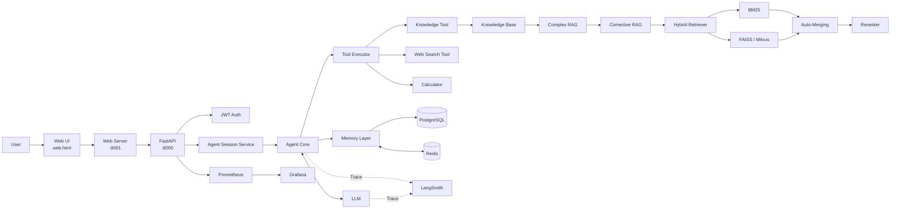

# Agentic RAG Assistant

> A production-oriented Agentic RAG application for Chinese knowledge-base question answering.

Agentic RAG Assistant 是一个面向中文知识问答场景的 **LLM Agent + Advanced RAG 工程项目**。

项目不只是实现传统的：

RAG → LLM → Answer

而是将 **Agent Tool Calling、Hybrid Retrieval、Corrective RAG、复杂问题拆解、多用户 Memory、可观测性、自动评测与 Docker 部署** 整合成一套完整应用。

---

## 1. Project Overview

### 核心能力

| 模块 | 能力 |
|---|---|
| Agent | 多轮 Tool Calling Loop |
| Tools | Knowledge Search / Web Search / Calculator |
| RAG | Hybrid RAG + Corrective RAG + Complex RAG |
| Retrieval | BM25 + Vector Search + RRF |
| Vector Store | FAISS / Milvus |
| Reranking | Optional Cross-Encoder Reranker |
| Chunking | Hierarchical Chunking |
| Context | Auto-Merging |
| Memory | Chat Memory + Explicit Long-term Memory |
| Database | PostgreSQL |
| Cache | Redis |
| Authentication | JWT + Multi-user Isolation |
| API | FastAPI |
| Web | Browser Web UI |
| Evaluation | Retrieval / RAG / Concurrency Tests |
| Metrics | Prometheus |
| Dashboard | Grafana |
| Tracing | LangSmith |
| Deployment | Docker Compose |

---

## 2. System Architecture



---

## 3. Request Lifecycle

一次网页聊天请求的完整链路：

```text
Browser
  ↓
web.html
  ↓
Web Server :8001
  ↓
web_server.py
  ↓
api_client.py
  ↓
HTTP
  ↓
Uvicorn :8000
  ↓
FastAPI
  ↓
api.py
  ↓
JWT Authentication
  ↓
Request Validation
  ↓
Agent Session
  ↓
Agent
  ↓
LLM / Tool / RAG
  ↓
Response
  ↓
Browser
```

后端核心入口：

```text
api.py
  ↓
app/auth/
  ↓
app/services/
  ↓
app/agent/
  ↓
rag/
```

---

## 4. Agent Architecture

Agent 核心代码：

```text
app/agent/
├── agent.py
├── prompt.py
├── tools.py
├── tools_config.py
└── tool_executor.py
```

核心执行循环：

```text
User Query
    ↓
Load History / Memory
    ↓
Build Messages
    ↓
Call LLM
    ↓
tool_calls ?
    │
    ├── No
    │    ↓
    │  Final Answer
    │
    └── Yes
         ↓
    Tool Executor
         ↓
    Execute Tool
         ↓
    Tool Result
         ↓
    Append to Messages
         ↓
    Call LLM Again
```

### Loop Protection

Agent 当前包含：

- 最大模型步骤保护
- 最大工具调用次数保护
- 重复 Tool Call 检测
- Session Lock
- Global Semaphore
- LLM Retry
- Tool Error Handling

Mock 测试已经覆盖：

```text
No Tool
Single Tool
Multi-step Tool Calling
Duplicate Tool Protection
Max Tool-call Protection
```

运行：

```bash
python tests/test_agent_mock.py
```

---

## 5. Agent Tools

当前主要工具：

### `search_knowledge`

查询本地知识库。

```text
Agent
  ↓
search_knowledge
  ↓
KnowledgeBase
  ↓
Advanced RAG
  ↓
Evidence
```

### `search_web`

获取需要实时外部信息的内容。

### `calculator`

执行受控数学计算。

---

## 6. Advanced RAG Architecture

RAG 核心代码统一位于：

```text
rag/
├── knowledge_base.py
├── retriever.py
├── corrective_rag.py
├── rag_graph.py
├── reranker.py
├── auto_merger.py
├── hierarchical_chunks.py
├── vector_backends.py
└── milvus_store.py
```

整体流程：

```text
User Query
    ↓
KnowledgeBase
    ↓
Complexity Routing
    ↓
┌──────────────────────────────┐
│                              │
Simple Query               Complex Query
│                              │
Corrective RAG             Decomposition
│                              │
Hybrid Retrieval           Parallel Retrieval
│                              │
Evidence Grade             Evidence Merge
│                              │
Query Rewrite              Coverage Grade
│                              │
Retry Retrieval                │
│                              │
└──────────────┬───────────────┘
               ↓
          Final Evidence
               ↓
             Agent
               ↓
              LLM
```

---

## 7. Hybrid Retrieval

核心：

```text
rag/retriever.py
```

检索流程：

```text
                    Query
                      ↓
        ┌─────────────┴─────────────┐
        │                           │
       BM25                    Vector Search
  Keyword Retrieval           Semantic Retrieval
        │                           │
        └─────────────┬─────────────┘
                      ↓
                     RRF
                      ↓
                Candidate Docs
                      ↓
                Auto-Merging
                      ↓
             Reranker (Optional)
                      ↓
                    Top-K
```

### BM25

适合关键词、专有名词和明确文本匹配。

### Vector Search

负责语义相似检索。

### RRF

融合关键词与语义两路排序结果。

### Reranker

对候选结果进行精排。

项目通过评测决定是否启用 Reranker，而不是默认认为“模型越多越好”。

---

## 8. Corrective RAG

核心：

```text
rag/corrective_rag.py
```

流程：

```text
Query
  ↓
Retrieval #1
  ↓
Evidence Grade
  ↓
Evidence Sufficient?
  │
  ├── Yes → Return Evidence
  │
  └── No
       ↓
   Query Rewrite
       ↓
   Retrieval #2
       ↓
   Evidence Grade
       ↓
   Return Evidence
   or
   Evidence Insufficient
```

目的：

> 不是“检索到内容就回答”，而是先判断证据是否真的足以支持回答。

---

## 9. Complex RAG

复杂问题进入：

```text
rag/rag_graph.py
```

执行：

```text
Complex Question
      ↓
Question Decomposition
      ↓
Sub Questions
      ↓
Parallel Retrieval
      ↓
Evidence Evaluation
      ↓
Merge
      ↓
Coverage Grade
      ↓
Final Evidence
```

这种方式比直接使用一个长 Query 检索，更适合多条件、多事实问题。

---

## 10. Hierarchical Chunking

核心：

```text
rag/hierarchical_chunks.py
rag/auto_merger.py
```

建库：

```text
Document
   ↓
Parent Chunk
   ↓
Child Chunks
   ↓
Embedding
   ↓
Vector Store
```

检索：

```text
Child Matches
   ↓
Same Parent?
   ↓
Auto-Merging
   ↓
Return Larger Context
```

这样既保留小 Chunk 的检索精度，又减少上下文被切得过碎的问题。

---

## 11. Vector Backends

统一接口：

```text
rag/vector_backends.py
```

当前支持：

```text
FAISS Backend
Milvus Backend
```

### FAISS

本地索引：

```text
faiss_index/
├── index.faiss
├── index.pkl
└── parent_store.json
```

### Milvus

Docker 服务：

```text
Milvus Standalone
├── etcd
└── MinIO
```

验证：

```bash
docker compose exec -T api \
python scripts/milvus_search_test.py \
"项目架构" \
--top-k 1
```

---

## 12. Knowledge Base Build

入口：

```bash
python build_index.py
```

流程：

```text
data/knowledge/
      ↓
Load PDF / MD / TXT
      ↓
Text Cleaning
      ↓
Metadata
      ↓
Chunking
      ↓
Embedding
      ↓
Vector Index
      ↓
Persist
```

网页重建：

```text
Web UI
  ↓
web_server.py
  ↓
api_client.py
  ↓
FastAPI
  ↓
Knowledge Service
  ↓
build_index.py
  ↓
Reload KnowledgeBase
```

---

## 13. Memory

应用层：

```text
app/memory/
├── chat_memory.py
├── explicit_memory.py
└── user_memory.py
```

数据库层：

```text
app/db/
├── postgres.py
├── postgres_memory.py
├── postgres_user_memory.py
└── redis_cache.py
```

### Chat Memory

保存聊天上下文与历史。

### Explicit Long-term Memory

只有用户明确要求长期记录的信息才进入长期记忆。

```text
User Explicit Memory Request
          ↓
Explicit Memory
          ↓
Structured Memory
          ↓
User Memory Store
```

Docker 环境中：

```text
PostgreSQL
    ↓
Persistent Data / Source of Truth

Redis
    ↓
Cache
```

---

## 14. Authentication & Multi-user Isolation

认证模块：

```text
app/auth/
├── router.py
├── security.py
└── user_store.py
```

主要能力：

- 用户注册
- 用户登录
- JWT Token
- Admin / User Role
- API Authentication
- User-level Memory Isolation
- User-level Session Isolation

---

## 15. Backend Structure

业务层已经按职责拆分：

```text
app/
├── agent/
│   └── Agent / Tools
│
├── auth/
│   └── Authentication
│
├── core/
│   └── LLM / Streaming / Observability
│
├── db/
│   └── PostgreSQL / Redis
│
├── integrations/
│   └── External Integrations
│
├── memory/
│   └── Chat / Long-term Memory
│
├── routes/
│   └── API Sub-routes
│
├── services/
│   └── Business Services
│
└── schemas.py
```

---

## 16. Project Structure

```text
Agentic RAG Assistant/
├── app/
│   ├── agent/
│   │   ├── agent.py
│   │   ├── prompt.py
│   │   ├── tool_executor.py
│   │   ├── tools.py
│   │   └── tools_config.py
│   │
│   ├── auth/
│   │   ├── router.py
│   │   ├── security.py
│   │   └── user_store.py
│   │
│   ├── core/
│   │   ├── llm_client.py
│   │   ├── observability.py
│   │   └── stream_events.py
│   │
│   ├── db/
│   │   ├── postgres.py
│   │   ├── postgres_memory.py
│   │   ├── postgres_user_memory.py
│   │   └── redis_cache.py
│   │
│   ├── integrations/
│   │   └── web_search.py
│   │
│   ├── memory/
│   │   ├── chat_memory.py
│   │   ├── explicit_memory.py
│   │   └── user_memory.py
│   │
│   ├── routes/
│   │   ├── history.py
│   │   └── user_memory.py
│   │
│   ├── services/
│   │   ├── agent_session.py
│   │   └── knowledge_service.py
│   │
│   └── schemas.py
│
├── rag/
│   ├── auto_merger.py
│   ├── corrective_rag.py
│   ├── hierarchical_chunks.py
│   ├── knowledge_base.py
│   ├── milvus_store.py
│   ├── rag_graph.py
│   ├── reranker.py
│   ├── retriever.py
│   └── vector_backends.py
│
├── tests/
├── evaluation/
├── scripts/
├── monitoring/
├── data/
├── faiss_index/
│
├── api.py
├── api_client.py
├── web_server.py
├── web.html
├── cli.py
├── build_index.py
├── config.py
│
├── Dockerfile
├── docker-compose.yml
├── docker-compose.override.yml
├── requirements.txt
├── requirements-docker.txt
├── README.md
└── DEPLOYMENT.md
```

---

## 17. Docker Architecture

```text
Docker Compose
│
├── api
│   └── FastAPI :8000
│
├── web
│   └── Web :8001
│
├── postgres
│   └── Persistent Application Data
│
├── redis
│   └── Cache
│
├── milvus-standalone
│   └── Vector Database
│
├── milvus-etcd
│   └── Metadata
│
├── milvus-minio
│   └── Object Storage
│
├── prometheus
│   └── Metrics
│
└── grafana
    └── Dashboard
```

---

## 18. Observability

### Prometheus

指标实现：

```text
app/core/observability.py
```

FastAPI 暴露：

```text
/metrics
```

监控范围包括：

- HTTP Request
- Request Latency
- Agent
- LLM
- Tool
- RAG
- Errors
- Concurrency

### Grafana

Dashboard：

```text
monitoring/grafana/dashboards/agentic-rag.json
```

地址：

```text
http://127.0.0.1:3600
```

### LangSmith

负责单请求 Trace：

```text
Agent
├── LLM
├── Tool
│   └── RAG
└── LLM
```

---

## 19. Evaluation

评估代码：

```text
evaluation/
├── evaluate_retrieval.py
├── evaluate_retrieval_compare.py
├── evaluate_retrieval_latency.py
├── run_evaluation.py
└── results/
```

测试数据：

```text
data/evaluation/
```

用于比较：

- FAISS Only
- Hybrid Retrieval
- Hybrid + Reranker
- Retrieval Accuracy
- Retrieval Latency

---

## 20. Automated Tests

### Agent Mock

```bash
python tests/test_agent_mock.py
```

覆盖：

- 不调用工具
- 单工具调用
- 连续 Tool Calling
- 重复工具调用保护
- 最大工具次数保护

### API Concurrency

```bash
python tests/test_api_concurrency.py
```

### Concurrency Limit

```bash
python tests/test_api_concurrency_limit.py
```

---

## 21. Quick Start

### Local

安装依赖：

```bash
pip install -r requirements.txt
```

创建配置：

```bash
cp config.example.toml config.toml
```

构建知识库：

```bash
python build_index.py
```

启动 API：

```bash
python -m uvicorn api:app \
  --host 0.0.0.0 \
  --port 8000
```

启动 Web：

```bash
python web_server.py \
  --host 0.0.0.0 \
  --port 8001
```

---

## 22. Docker

启动：

```bash
docker compose up -d
```

状态：

```bash
docker compose ps
```

API 日志：

```bash
docker compose logs -f api
```

关闭：

```bash
docker compose down
```

> Do not use `docker compose down -v` unless you intentionally want to remove persistent volumes.

---

## 23. Service Endpoints

| Service | Address |
|---|---|
| Web | `http://127.0.0.1:8001` |
| FastAPI | `http://127.0.0.1:8000` |
| Swagger | `http://127.0.0.1:8000/docs` |
| Health | `http://127.0.0.1:8000/health` |
| Grafana | `http://127.0.0.1:3600` |
| Milvus | `127.0.0.1:19530` |

---

## 24. Security

真实 Secret 不应提交到 Git：

```text
config.toml
config.docker.toml
.langsmith.env
.db.env
.minio.env
```

仓库中只保留示例配置：

```text
config.example.toml
config.docker.example.toml
.langsmith.env.example
.db.env.example
```

敏感信息包括：

- LLM API Key
- LangSmith API Key
- JWT Secret
- PostgreSQL Password
- MinIO Credentials

---

## 25. Engineering Highlights

1. Agent 自主决定是否使用 RAG，而不是每个问题固定走检索。
2. Tool Calling 支持多轮循环并具有明确的停止保护。
3. Hybrid Retrieval 同时利用关键词召回与语义召回。
4. Corrective RAG 会评估证据质量并执行 Query Rewrite。
5. Complex RAG 支持问题拆解和并行子问题检索。
6. Hierarchical Chunking + Auto-Merging 改善上下文完整性。
7. FAISS / Milvus 使用统一 Vector Backend。
8. PostgreSQL 负责持久化，Redis 负责缓存。
9. JWT + user_id 实现多用户隔离。
10. 提供 Agent、检索、并发和延迟自动化测试。
11. Prometheus / Grafana 提供系统指标。
12. LangSmith 提供单次请求 Trace。
13. Docker Compose 提供完整运行环境。

---

## 26. Project Positioning

Agentic RAG Assistant 的目标不是只完成：

> “让大模型能够回答知识库问题。”

而是探索一个完整 LLM Agent 系统中的工程问题：

```text
How does the Agent decide to use tools?
How is retrieval quality improved?
What happens when evidence is insufficient?
How are complex questions decomposed?
How is memory persisted and isolated?
How are multiple users isolated?
How is concurrency controlled?
How is the system evaluated?
How is it monitored?
How is a single request traced?
How is the application deployed?
```

最终目标：

> **Build an Agentic RAG application that is runnable, testable, evaluable, observable, traceable and deployable.**
