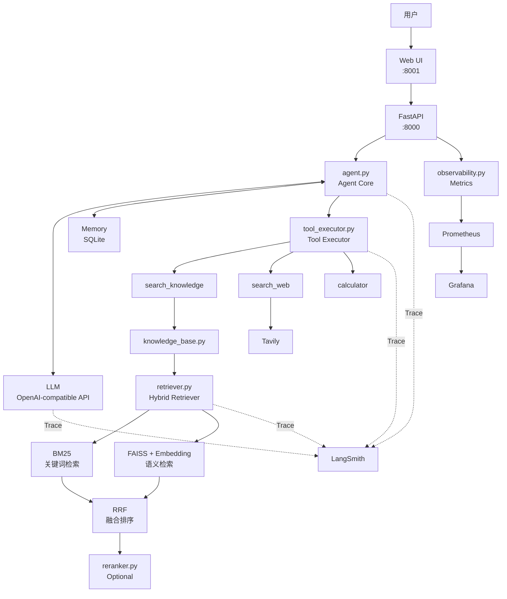

# Agentic RAG Assistant

一个面向中文场景的 **Agentic RAG 应用**。

项目以 FastAPI 为服务入口，结合 LLM Tool Calling、Hybrid RAG、短期/长期记忆、联网搜索、并发控制、Docker Compose 部署，以及 Prometheus + Grafana + LangSmith 可观测性，形成一套较完整的 LLM Agent 应用工程。

---

## 核心能力

- **Agent Tool Calling**：支持多轮 LLM → Tool → LLM 循环，并加入最大步骤数、最大工具调用次数和重复调用保护。
- **Hybrid RAG**：BM25 关键词检索 + Embedding/FAISS 语义检索 + RRF 融合排序，并集成可选 Cross-Encoder Reranker。
- **三类 Agent 工具**：`search_knowledge`、`search_web`、`calculator`。
- **Memory**：SQLite 短期聊天历史 + 显式长期记忆。
- **并发与稳定性**：Session Lock + Global Semaphore + LLM 重试/降级。
- **可观测性**：Prometheus + Grafana + LangSmith。
- **工程化部署**：FastAPI、Web、Docker Compose、监控服务与数据持久化。

---

## 系统架构



---

## Agent 执行流程

```text
用户问题
↓
读取短期历史 / 长期记忆
↓
组装 messages
↓
调用 LLM
↓
模型是否产生 tool_calls？
│
├─ 否 → 直接生成答案
│
└─ 是
   ↓
tool_executor.py
   ↓
执行对应工具
   ↓
工具结果加入 messages
   ↓
再次调用 LLM
   ↓
模型继续判断是否调用工具
↓
达到最终答案或调用上限
↓
保存聊天历史
↓
返回用户
```

Agent 设置循环保护，避免模型重复调用同一个工具或陷入无限 Tool Calling。

---

## Tools

### `search_knowledge`

用于查询本地知识库：

```text
Agent
↓
search_knowledge
↓
knowledge_base.py
↓
HybridRetriever
↓
BM25 + FAISS + RRF
↓
返回相关文档
```

### `search_web`

用于获取实时外部信息，底层使用 Tavily Web Search。

### `calculator`

用于安全数学计算，不直接执行任意 Python 代码。

---

## Hybrid RAG

```text
用户问题
↓
knowledge_base.py
↓
retriever.py
↓
┌────────────────────┬────────────────────┐
│                    │                    │
↓                    ↓
BM25                 FAISS
关键词召回            Embedding 语义召回
│                    │
└──────────┬─────────┘
           ↓
          RRF
       融合排序
           ↓
       候选文档
           ↓
    Reranker（可选）
           ↓
     最终 Top-K 文档
```

- **BM25**：解决明确关键词匹配。
- **FAISS + Embedding**：解决不同表达方式下的语义匹配。
- **RRF**：融合 BM25 与 FAISS 两路排序。
- **Reranker**：Cross-Encoder 重排能力已集成，默认关闭。

---

## RAG 离线建库

```bash
python build_index.py
```

流程：

```text
data/knowledge/
↓
加载 PDF / Markdown / TXT
↓
文本清洗与 metadata
↓
文本分块
↓
Embedding
↓
FAISS Index
↓
保存到本地
```

---

## RAG 评测

评测脚本：

- `evaluate_retrieval_compare.py`
- `evaluate_retrieval_latency.py`

评测数据：

```text
data/evaluation/
├── retrieval_cases.json
├── retrieval_compare_report.json
└── retrieval_latency_report.json
```

### 检索效果

| 检索方案 | Hit@1 | Hit@3 | MRR |
|---|---:|---:|---:|
| FAISS Only | 0.70 | 1.00 | 0.85 |
| Hybrid | **0.90** | **1.00** | **0.95** |
| Hybrid + Reranker | **0.90** | **1.00** | **0.95** |

### 检索延迟

| 检索方案 | Avg | P95 |
|---|---:|---:|
| FAISS Only | 22.61 ms | 63.54 ms |
| Hybrid | **16.14 ms** | **29.61 ms** |
| Hybrid + Reranker | 1749.84 ms | 2296.67 ms |

当前评测集中，Hybrid 相比 FAISS Only 提升了 Hit@1 和 MRR；继续加入 Reranker 后准确率没有进一步提高，但延迟显著增加，因此默认采用 **BM25 + FAISS + RRF**。

---

## Memory

### 短期记忆

`memory.py` 使用 SQLite 保存聊天历史。数据库保留完整历史，但进入模型上下文时只读取有限数量的最近消息。

### 长期记忆

主要涉及：

- `explicit_memory.py`
- `user_memory.py`
- `user_memory_routes.py`

长期记忆只保存用户明确要求长期记录的信息，并与普通聊天历史分开保存。

---

## 并发与稳定性

```text
/chat
↓
Session Lock
↓
Global Semaphore
↓
Agent.run()
```

- **Session Lock**：保证同一 `session_id` 的请求按顺序执行。
- **Global Semaphore**：当前最大 Agent 并发为 `2`，用于控制整体负载并形成简单 Backpressure。

---

## 可观测性

### Prometheus

FastAPI 暴露 `/metrics`，监控：

- HTTP 请求量、耗时、当前请求数。
- `/chat` 成功率、502/503、P50/P95。
- LLM 调用次数、耗时、success/error。
- Tool 调用次数、耗时、success/error。
- RAG 阶段调用次数、耗时、success/error。

配置：

```text
monitoring/prometheus/prometheus.yml
```

### Grafana

Dashboard：

```text
monitoring/grafana/dashboards/agentic-rag.json
```

用于展示 API 状态、请求量、成功率、HTTP P50/P95、并发、LLM/Tool/RAG 调用和错误指标。

### LangSmith

Prometheus + Grafana 更适合看整体指标，LangSmith 用于查看某一条请求内部的 Agent → LLM → Tool → RAG 调用链。

典型 Trace：

```text
Agent.run
├── LLM logical call
├── Tool.execute
│   └── Hybrid Retrieval
└── LLM logical call
```

项目默认隐藏 Trace 输入输出正文：

```text
LANGSMITH_HIDE_INPUTS=true
LANGSMITH_HIDE_OUTPUTS=true
```

### 实际性能定位案例

```text
Agent.run              16.08s
├── LLM                 4.83s
├── Hybrid Retrieval    0.22s
└── LLM                10.99s
```

该请求中 RAG 检索只占约 0.22 秒，主要耗时来自 LLM 推理。

---

## FastAPI

核心接口：

| Method | Path | 作用 |
|---|---|---|
| GET | `/health` | 服务健康检查 |
| POST | `/chat` | Agent 对话 |
| POST | `/search` | 直接检索知识库 |
| POST | `/knowledge/rebuild` | 重建知识库 |
| DELETE | `/sessions/{session_id}` | 删除指定会话 |
| GET | `/metrics` | Prometheus 指标 |

Swagger：

```text
http://127.0.0.1:8000/docs
```

---

## 项目结构

```text
Agentic RAG Assistant/
├── api.py
├── schemas.py
├── agent.py
├── client.py
├── prompt.py
├── tools.py
├── tools_config.py
├── tool_executor.py
├── web_search.py
├── knowledge_base.py
├── retriever.py
├── reranker.py
├── build_index.py
├── memory.py
├── explicit_memory.py
├── user_memory.py
├── user_memory_routes.py
├── history_routes.py
├── observability.py
├── web.html
├── web_server.py
├── api_client.py
├── rag_debug.py
├── evaluate_retrieval_compare.py
├── evaluate_retrieval_latency.py
├── test_agent_mock.py
├── test_api_concurrency.py
├── test_api_concurrency_limit.py
├── data/
│   ├── knowledge/
│   └── evaluation/
├── faiss_index/
├── monitoring/
│   ├── prometheus/
│   └── grafana/
├── Dockerfile
├── docker-compose.yml
├── docker-compose.override.yml
├── config.example.toml
├── config.docker.example.toml
├── .langsmith.env.example
├── requirements.txt
├── requirements-docker.txt
├── README.md
└── DEPLOYMENT.md
```

---

## 快速开始

### 1. 获取项目

```bash
git clone <your-repository-url>
cd "Agentic RAG Assistant"
```

### 2. 创建 Python 环境

```bash
python -m venv .venv
source .venv/bin/activate
```

### 3. 安装依赖

```bash
pip install -r requirements.txt
```

### 4. 创建配置

```bash
cp config.example.toml config.toml
```

根据自己的环境填写 LLM Base URL、API Key、模型名称、Embedding 模型路径和 Tavily 配置。

真实的 `config.toml`、`config.docker.toml`、`.langsmith.env` 均不应提交 Git。

### 5. 构建知识库

```bash
python build_index.py
```

### 6. 启动 FastAPI

```bash
python -m uvicorn api:app --host 0.0.0.0 --port 8000
```

### 7. 启动 Web

```bash
python web_server.py --host 0.0.0.0 --port 8001
```

---

## Docker Compose

```text
Docker Compose
├── api        → FastAPI :8000
├── web        → Web :8001
├── prometheus → :9090（Docker 网络内部）
└── grafana    → :3000
```

首次启动：

```bash
docker compose up -d --build
```

已有镜像时：

```bash
docker compose up -d --no-build
```

查看状态：

```bash
docker compose ps
```

停止：

```bash
docker compose down
```

---

## 服务地址

| 服务 | 地址 |
|---|---|
| Web | `http://127.0.0.1:8001` |
| FastAPI | `http://127.0.0.1:8000` |
| Swagger | `http://127.0.0.1:8000/docs` |
| Health | `http://127.0.0.1:8000/health` |
| Grafana | `http://127.0.0.1:3600` |

Prometheus 默认作为 Docker 内部服务提供给 Grafana：

```text
http://prometheus:9090
```

---

## 安全设计

`.gitignore` 应忽略：

```text
config.toml
config.docker.toml
.langsmith.env
*.bak_before_*
```

仓库中只保留配置模板：

```text
config.example.toml
config.docker.example.toml
.langsmith.env.example
```

---

## 测试

```bash
python test_agent_mock.py
python test_api_concurrency.py
python test_api_concurrency_limit.py
```

---

## 当前技术选型

| 模块 | 技术 |
|---|---|
| Web API | FastAPI |
| Agent | 自定义 Tool Calling Loop |
| LLM | OpenAI-compatible Chat Completions API |
| Embedding | BGE Small Chinese |
| Vector Store | FAISS |
| Keyword Retrieval | BM25 |
| Fusion | RRF |
| Reranker | BGE Cross-Encoder，可选 |
| Web Search | Tavily |
| Short-term Memory | SQLite |
| Long-term Memory | SQLite |
| Metrics | Prometheus |
| Dashboard | Grafana |
| Tracing | LangSmith |
| Deployment | Docker Compose |

---

## 项目工程亮点

1. **从单路 RAG 升级到 Hybrid RAG**：对比 FAISS Only、Hybrid、Hybrid + Reranker，并根据准确率与延迟决定默认方案。
2. **Agent Tool Calling 有明确循环保护**：限制最大步骤数、工具调用次数和重复调用。
3. **RAG 被封装成 Agent Tool**：由模型决定是否调用 `search_knowledge`，而不是每次固定执行 RAG。
4. **短期与长期记忆职责分离**：短期历史维持对话上下文，长期记忆保存明确要求长期记录的信息。
5. **加入并发控制和 Backpressure**：Session Lock 保证会话顺序，Global Semaphore 控制整体负载。
6. **指标监控 + 单请求 Trace**：Prometheus/Grafana 看整体系统，LangSmith 看单次请求内部链路。

---

## 已知限制

- 当前 LLM 使用 OpenAI-compatible 外部模型接口，响应时间会受到上游服务状态影响。
- 当前 RAG 评测集规模仍然较小，后续可以继续扩充。
- Reranker 在当前测试集中精度收益有限，因此默认关闭。
- 当前全局 Agent 并发限制较保守，更适合个人项目和演示环境。
- 本地 Embedding 和 FAISS 更适合中小规模知识库。

---

## 后续可扩展方向

- 扩充 RAG 评测集。
- 增加 Query Rewrite / Multi-Query / HyDE。
- 扩展更多 Agent Tools。
- 增加更完整的自动化测试。
- 引入缓存、任务调度等工程能力。
- 在更大规模知识库场景中评估 Milvus 等向量数据库。

---

## 项目定位

本项目重点不只是实现“能够回答问题”，还包括：

> 如何让一个 Agent 系统能够被部署、评测、监控、追踪，并根据实验结果做工程取舍。
